<picture>
  <source media="(prefers-color-scheme: dark)" srcset="https://readme-typing-svg.demolab.com?font=JetBrains+Mono&size=17&duration=2800&pause=900&center=true&vCenter=true&width=620&height=34&color=79C0FF&lines=Software+Engineer;AWS+Certified+Solutions+Architect+%E2%80%93+Associate;Go+%C2%B7+Kubernetes+%C2%B7+Distributed+Systems;AI+%26+Workflow+Automation;MSc+Data+Science+%26+AI+%40+University+of+Moratuwa">
  
</picture>

 

 

<picture>
  <source media="(prefers-color-scheme: dark)" srcset="assets/terminal-dark.svg">
  
</picture>

 

## 📂 `~/projects`

<table>
<tr>
<td width="50%" valign="top">
<h3 align="center"><a href="https://github.com/DulsaraNethmin/Shipper">🚚 Shipper</a></h3>

Road-transport delivery marketplace connecting customers with providers — Go backend, Flutter app, Next.js admin &amp; driver portals.

</td>
<td width="50%" valign="top">
<h3 align="center"><a href="https://github.com/DulsaraNethmin/Minter">🎭 Minter</a></h3>

Headless-browser fetch service exposing fully rendered HTML over a simple HTTP API.

</td>
</tr>
<tr>
<td width="50%" valign="top">
<h3 align="center"><a href="https://github.com/DulsaraNethmin/nest-rmq">🐇 nest-rmq</a></h3>

RabbitMQ module for NestJS — published to npm as <a href="https://www.npmjs.com/package/@iamnd/nest-rmq"><code>@iamnd/nest-rmq</code></a>.

</td>
<td width="50%" valign="top">
<h3 align="center"><a href="https://github.com/DulsaraNethmin/shopware-shopify-integration">🔄 shopware-shopify</a></h3>

Sync layer keeping Shopware and Shopify storefronts consistent — products, orders, inventory.

</td>
</tr>
</table>

🎯 Off the clock: <a href="https://github.com/DulsaraNethmin/relaxing-shooter"><b>relaxing-shooter</b></a> — a browser game in TypeScript. <a href="https://relaxing-shooter-kt8fk2ear-nethmin99s-projects.vercel.app">Play it →</a>

## 🧰 `~/stack`

<picture>
  <source media="(prefers-color-scheme: dark)" srcset="https://skillicons.dev/icons?i=go%2Cpy%2Cnextjs%2Caws%2Cdocker%2Clinux&perline=6&theme=dark">
  
</picture>

  

<picture>
  <source media="(prefers-color-scheme: dark)" srcset="https://skillicons.dev/icons?i=ts%2Cjava%2Ckubernetes%2Cnestjs%2Creact%2Cfastapi%2Cflutter%2Cgcp%2Cjenkins%2Cnginx%2Cgithubactions%2Cpostgres%2Cmongodb%2Credis%2Crabbitmq%2Ckafka%2Ctensorflow%2Cpytorch&perline=9&theme=dark">
  
</picture>

  

**🤖 AI &amp; Workflow Automation**

 

## 📈 `~/stats`

<picture>
  <source media="(prefers-color-scheme: dark)" srcset="https://streak-stats.demolab.com?user=DulsaraNethmin&hide_border=true&theme=github-dark-blue">
  
</picture>

  

<picture>
  <source media="(prefers-color-scheme: dark)" srcset="https://raw.githubusercontent.com/DulsaraNethmin/DulsaraNethmin/output/github-snake-dark.svg">
  
</picture>

 

---

<samp>Open to conversations about backend architecture, distributed systems, and AI-powered automation.</samp>

  

[LinkedIn](https://www.linkedin.com/in/nethmin) &nbsp;·&nbsp; [Email](mailto:dulsaranethmin@gmail.com)

